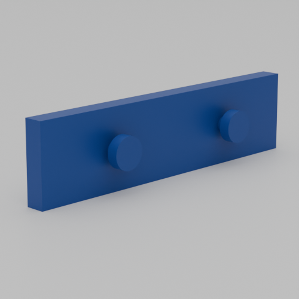
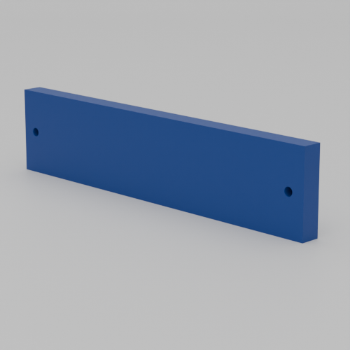
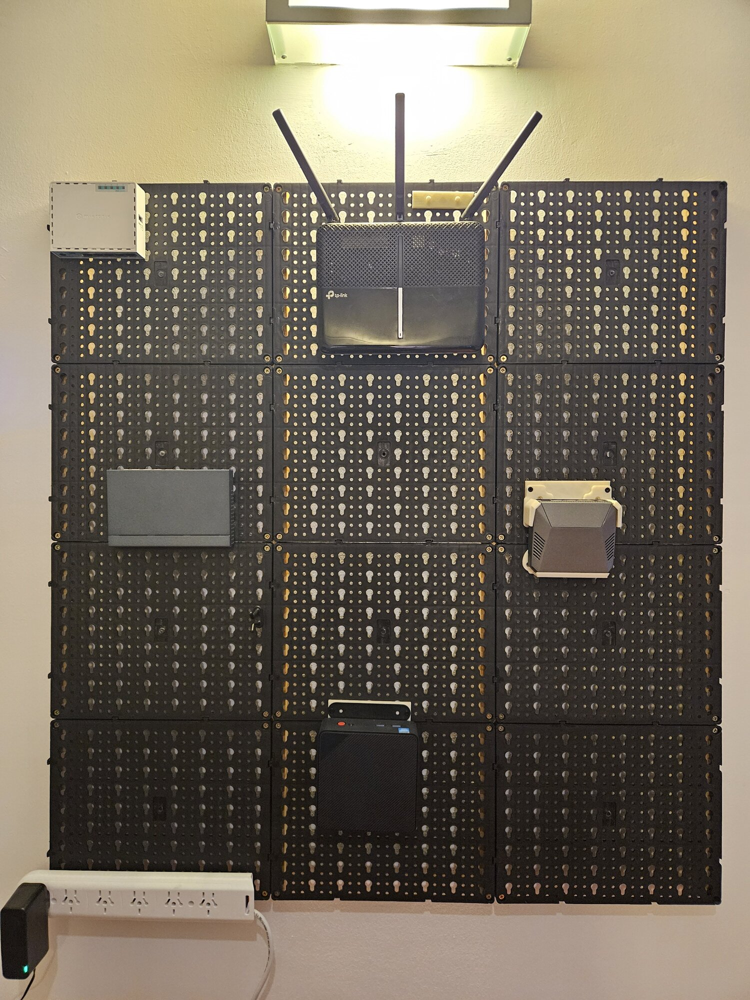
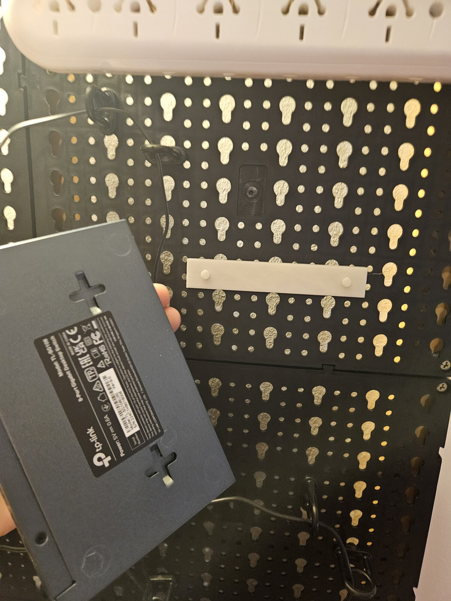
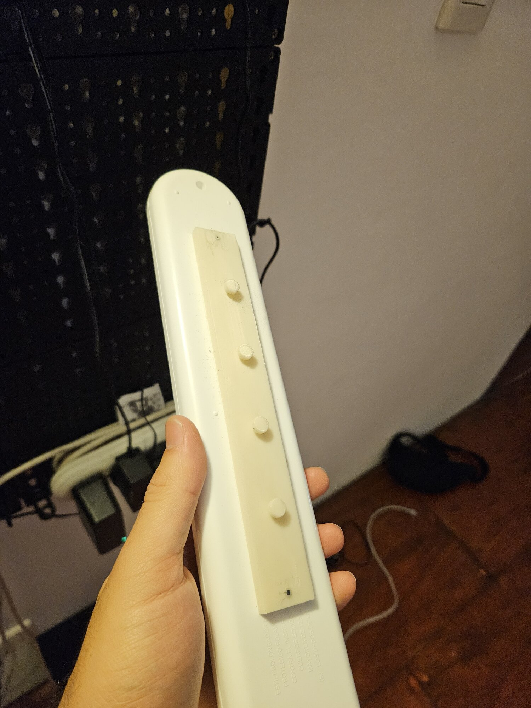
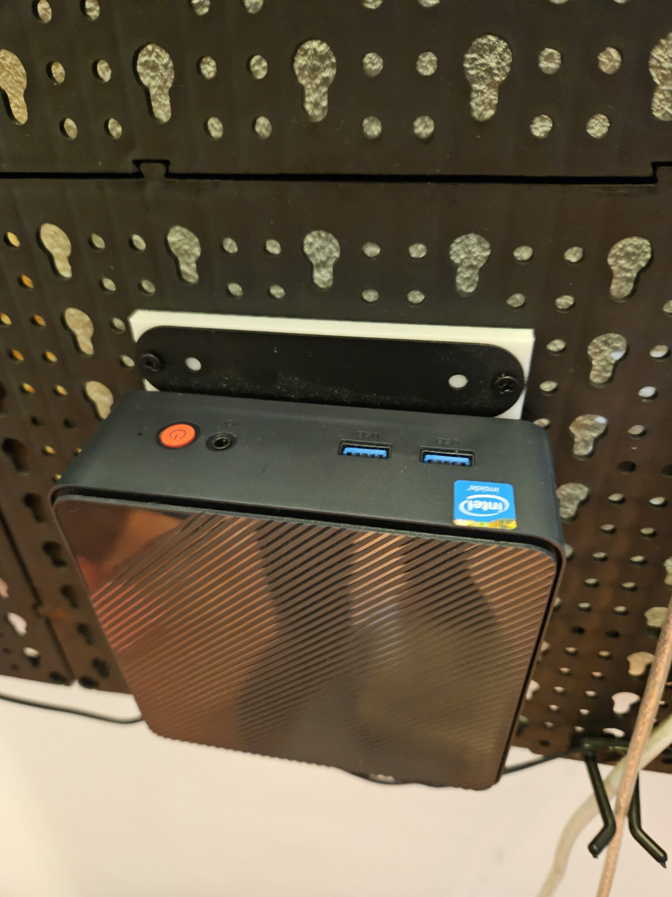

# Keyhole Pegboard Adapter

A customizable OpenSCAD adapter for mounting devices to keyhole pegboard systems.

**Note:** While this project includes two example STL files (`example_holes.stl` and `example_pegs.stl`), they are unlikely to be usable on any keyhole pegboard as sizes are not standardized. You will need to customize the parameters to match your specific pegboard and device.

## Features

The adapter has two mounting modes:

1. **Peg mode** - For devices that also have keyholes, rendering pegs on both sides (wall-facing and device-facing)
2. **Screw mode** - For devices that are attached with screws, rendering screw holes in the base instead of device-facing pegs

## Example Presets

The OpenSCAD Customizer includes several example presets for common devices. These presets are configured to work with my specific pegboard, but **be careful** - they might not work with your pegboard as keyhole sizes are not standardized. You will likely need to adjust the wall peg parameters to match your pegboard system.

### Network Equipment

- **TP-Link TL-SG105** - 5-port gigabit switch (80mm wide, 2 wall pegs, 2 device pegs)
- **TP-Link TL-SG108** - 8-port gigabit switch (120mm wide, 3 wall pegs, 2 device pegs)
- **Mikrotik Hex RB750Gr3** - Router (92mm wide, 2 wall pegs, 2 device pegs with 70mm separation)
- **TP-Link A10** - Access point (105mm wide, 3 wall pegs, 2 device pegs)
- **Technicolor DPC3848VE** - Cable modem (120mm wide, 3 wall pegs, 2 device pegs with tall 9mm narrow pegs)

### Universal Mounts

- **VESA 100** - VESA 100x100 mount (110mm wide, 3 wall pegs, screw holes instead of device pegs)
- **Power Strip** - Generic power strip mount (110mm wide, 3 wall pegs, screw holes instead of device pegs)

Each preset defines:

- **Base dimensions** (`base_width`, `base_length`, `base_depth`) - Physical size of the adapter plate
- **Wall peg settings** - Configuration for the pegboard-facing pegs (separation, count, diameters, heights)
- **Device attachment** - Either pegs (for keyhole devices) or screw holes (for screw-mounted devices)
- **Skip center** - Whether to only render first/last pegs when multiple pegs are specified

## Usage

1. Open `main.scad` in OpenSCAD
2. Select a preset from the dropdown, or customize the parameters manually
3. Adjust dimensions to match your device's mounting holes or keyhole spacing
4. Export to STL and print

## Parameters Guide

### Pegboard Configuration

Set these once to match your pegboard system (standard keyhole pegboard values are pre-configured):

- `wall_hole_separation` - Distance between pegboard hole centers (typically 37.5mm)
- `wall_hole_*_diameter` - Narrow and wide portions of pegboard keyhole
- `wall_peg_*_diameter` - Narrow and wide portions of the mounting pegs
- `wall_peg_*_height` - Heights of narrow and wide peg portions

### Base Settings

Adjust per device:

- `base_width` - Total width of adapter plate
- `base_length` - Height/length of adapter plate
- `base_depth` - Thickness of base plate

### Device Attachment

**For keyhole devices (Peg mode):**

- Enable `device_peg_enable = true`
- Set `device_hole_separation` to match device's keyhole spacing
- Configure peg diameters and heights to fit device keyholes
- Use `device_peg_count` and `device_peg_skip_center` to control peg layout

**For screw-mounted devices (Screw mode):**

- Enable `base_hole_enable = true` (automatically disables device pegs)
- Set `base_hole_separation` to match device's screw hole spacing
- Set `base_hole_diameter` to match your screw size
- Set `base_hole_depth` (must be less than `base_depth`)

## Gallery

### Renders

  
  

### Photos

  
  

  
  

