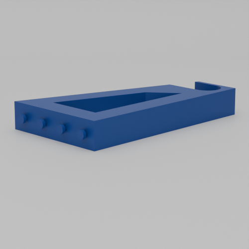
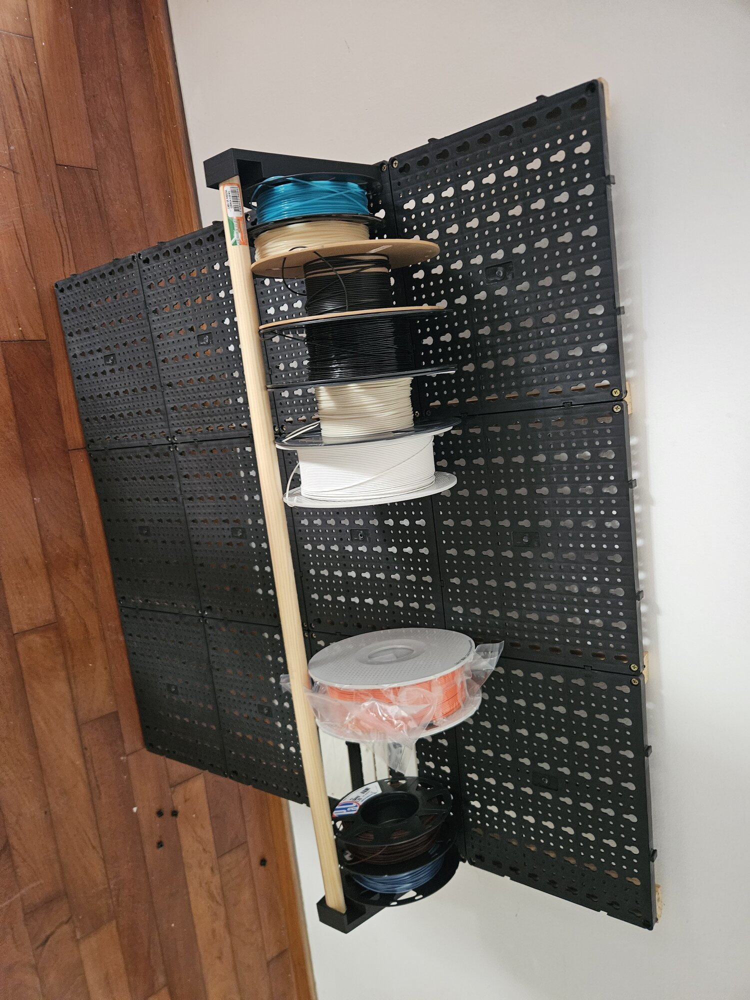

# Keyhole Pegboard Spool Holder

A filament spool holder that mounts to keyhole pegboard systems. This design combines an imported spool holder model with parametric keyhole pegs for wall mounting.

Based on [IKEA Skadis & Komplement Filament Spool Holder - 26mm](https://makerworld.com/en/models/168987-ikea-skadis-filament-spool-holder-26mm) by [brusarp](https://www.thingiverse.com/brusarp/designs)

## Design

This project imports the original spool holder STL (`original.stl`) and adds keyhole pegs to mount it to pegboard. The pegs are generated parametrically using BOSL2, allowing customization for different pegboard systems.

The holder requires two printed pieces (one mirrored) connected by a broom handle that acts as the spool axle.

**Note:** The included STL is configured for my specific pegboard system. Since keyhole pegboard sizes are not standardized, you will need to adjust the pegboard parameters to match your pegboard.

## Usage

1. Open `main.scad` in OpenSCAD
2. Adjust pegboard parameters to match your specific pegboard system
3. Configure peg count and spacing for your desired mounting configuration
4. Export to STL and print two copies (mirror one piece in your slicer)
5. Insert a broom handle through both pieces to connect them and support the filament spool

## Parameters Guide

### Pegboard Configuration

These parameters define the pegboard system dimensions:

- `wall_hole_separation` - Distance between pegboard hole centers
- `wall_hole_narrow_diameter` - Narrow portion of pegboard keyhole diameter
- `wall_hole_wide_diameter` - Wide portion of pegboard keyhole diameter
- `wall_peg_narrow_diameter` - Narrow portion of mounting peg diameter
- `wall_peg_wide_diameter` - Wide portion of mounting peg diameter
- `wall_peg_narrow_height` - Height of narrow peg portion
- `wall_peg_wide_height` - Height of wide peg portion

### Wall Peg Settings

- `wall_peg_count` - Number of pegs to generate
- `wall_peg_skip_center` - Only render first and last peg (useful for widely-spaced mounts)

### Base Settings

- `base_width` - Total width of the peg base
- `base_length` - Length/height of the peg base
- `base_depth` - Thickness of the peg base

## Gallery

### Renders

  

### Photos

  

