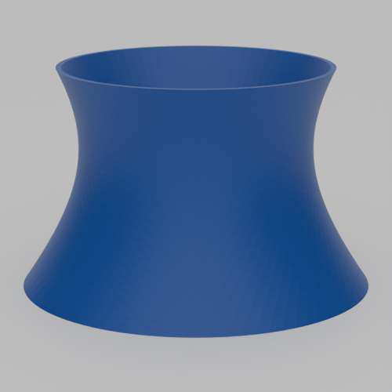
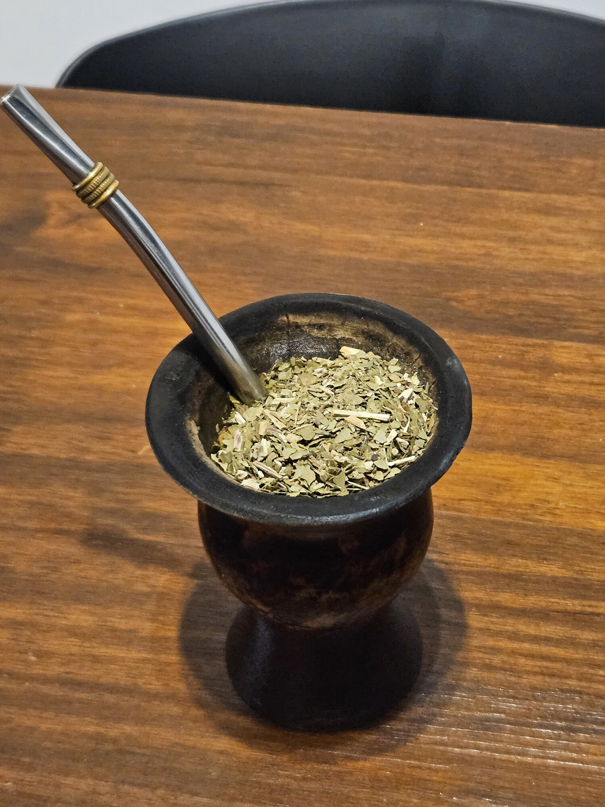
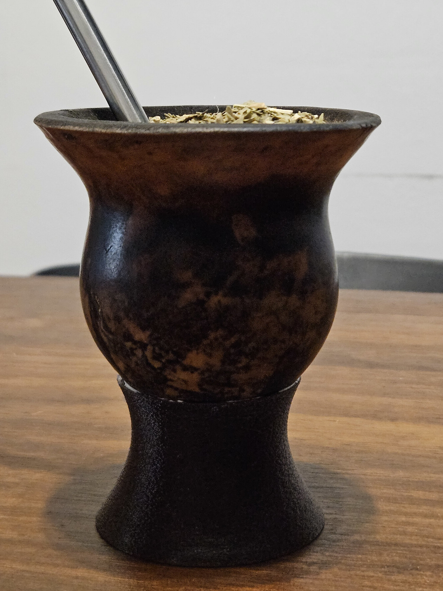

# Mate Base

A customizable OpenSCAD holder base designed for mate and similar cylindrical containers. Features a twisted, tapered design with an internal wedge for secure grip.

**Note:** This project includes a pre-made STL file (`output/mate-base.stl`) with default dimensions, but it is unlikely to work with any mate other than mine. The provided STL is designed specifically for [calabash (gourd)](https://en.wikipedia.org/wiki/Calabash) mates, which have natural variations in size and shape. You will almost certainly need to customize the parameters to fit your specific mate.

**Important:** Epoxy (or other strong, water-resistant, heat-resistant, and non-toxic adhesive) is needed to securely attach the base to the mate.

## Features

- **Twisted design** - Aesthetically pleasing spiral shape created by rotating the top relative to the bottom
- **Tapered profile** - Gradually transitions from a wider base to a narrower top opening
- **Internal wedge** - Conical cutout provides friction grip to hold the mate securely
- **Fully parametric** - All dimensions can be adjusted to fit different mate sizes

## Parameters Guide

### Base Dimensions

Adjust these to match your mate's size:

- `bottom_diameter` - Diameter of the base (default: 63.5mm for stability)
- `top_diameter` - Diameter of the top opening (default: 50mm to match typical mate)
- `height` - Total height of the holder (default: 40mm)

### Wedge Settings

Control the internal grip mechanism:

- `wedge_depth` - How deep the wedge cutout goes from the top (default: 30mm)
- `wedge_inner_diameter` - Diameter at the bottom of the wedge (default: 10mm)
- `wedge_wall_thickness` - Wall thickness around the wedge (default: 2mm)

**Tip:** The wedge creates a friction fit. Increase `wedge_wall_thickness` for a tighter grip, or decrease it for easier insertion/removal.

### Shape Settings

Customize the aesthetic appearance:

- `rotation` - Rotation angle applied to the top (default: 80°, creates the twisted effect)
- `faces` - Number of faces for the twisted shape (default: 40, higher = smoother but slower to render)

## Usage

1. Open `main.scad` in OpenSCAD
2. Use the Customizer (View → Customizer) to adjust parameters
3. Preview with F5, render with F6
4. Export to STL (File → Export → Export as STL)

### Measuring Your Mate

To customize for your mate:

1. Measure the outer diameter of your mate where it will sit in the holder
2. Set `top_diameter` slightly larger (1-2mm) than your mate diameter
3. Set `bottom_diameter` about 10-15mm larger than `top_diameter` for stability
4. Adjust `height` to support your mate adequately (typically 30-50mm)

## Gallery

### Renders

### Photos

  
  

