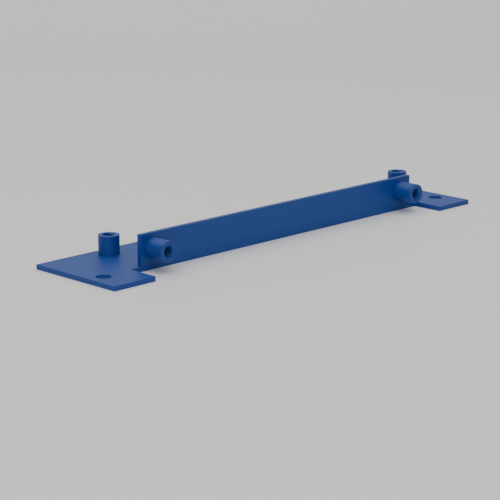
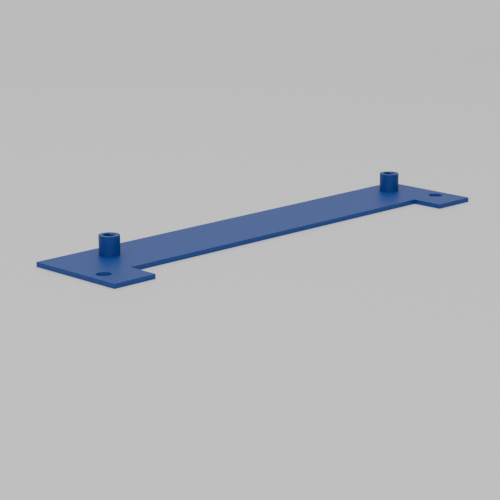
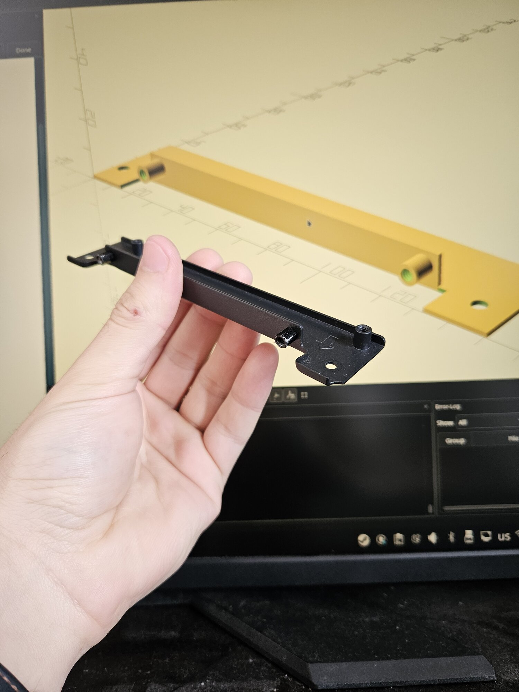
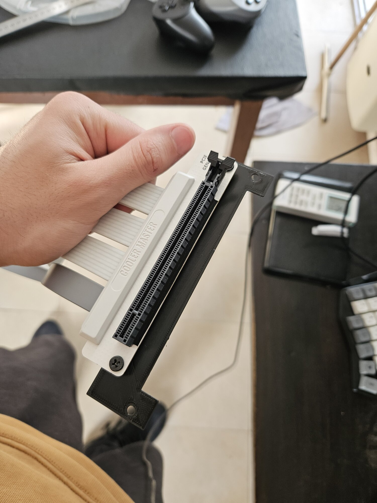
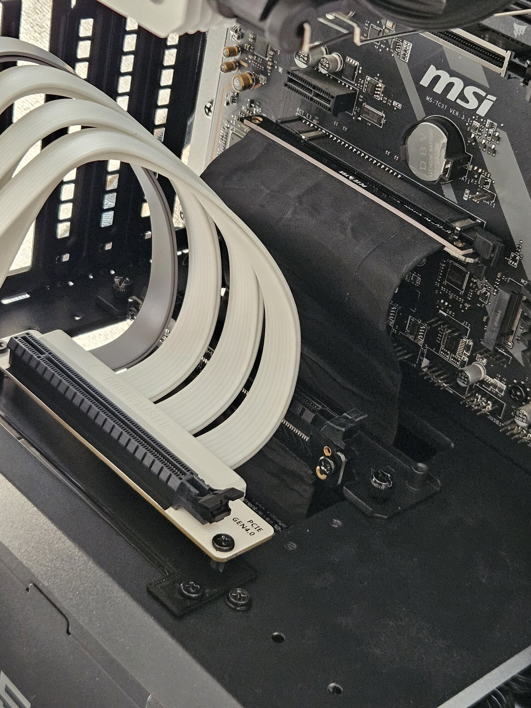
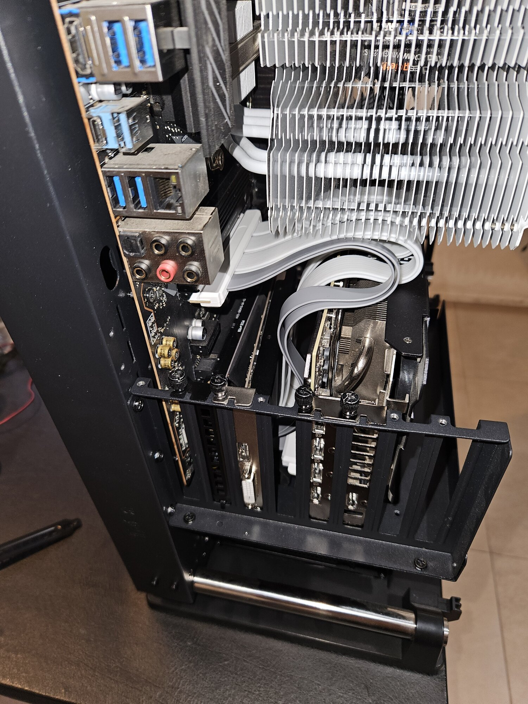

# PCIe Riser Bracket - Thermaltake Core P3

A parametric OpenSCAD replacement for the vertical GPU mounting bracket that comes with the [Thermaltake Core P3 TG Pro](https://thermaltakeusa.com/products/core-p3-tg-pro-ca-1g4-00m1wn-09) open frame case ([archived link](https://web.archive.org/web/20260216081816/https://thermaltakeusa.com/products/core-p3-tg-pro-ca-1g4-00m1wn-09)).

## Why This Exists

I created this project because I needed to install two GPUs (an AMD RX 550 and an NVIDIA RTX 3080 Ti) vertically in my Core P3 case, but the case only includes one mounting bracket. Rather than buying another OEM bracket, I designed a parametric version that could be 3D printed.

The parametric design became essential when I purchased a [Cooler Master PCIe 4.0 x16 300mm riser cable](https://www.coolermaster.com/en-global/products/riser-cable-pcie-40-x16-300mm/) ([archived link](https://web.archive.org/web/20260213161211/https://www.coolermaster.com/en-global/products/riser-cable-pcie-40-x16-300mm/)) and discovered the mounting holes didn't align with the Thermaltake bracket dimensions. This project includes presets for both configurations.

**Tip:** If you're considering a similar setup, I recommend getting a shorter riser cable. The 300mm cable works but leaves a lot of excess cable to manage.

## Features

- **Parametric design** - Fully customizable dimensions for different riser cables and mounting configurations
- **Standoff options** - Choose between printed standoffs or metal standoffs
- **Dual bracket support** - Optional vertical bracket for 180° riser cables
- **Presets included** - Default Thermaltake dimensions and Cooler Master PCIe 4.0 configuration

## Presets

The OpenSCAD Customizer includes two example presets:

### Design Default Values

Standard dimensions matching the original Thermaltake Core P3 mounting bracket.

### Cooler Master PCI4

Adjusted mounting positions for the Cooler Master PCIe 4.0 x16 300mm riser cable, with holes repositioned to match the cable's mounting points.

## Parameters Guide

### Bracket Configuration

- `add_vertical_bracket` - Enable to print the vertical bracket for 180° riser cables (default: false)

### Standoff Options

- `use_standoffs_vertical` - Use printed standoffs on the vertical bracket instead of screw holes (default: false)
- `use_standoffs_horizontal` - Use printed standoffs on the horizontal bracket instead of screw holes (default: true)

### Metal Standoff Options

- `screw_hole_oversize` - Size adjustment for metal standoff screw holes (default: -0.5mm)

**Tip:** Adjust this value if metal standoffs are too tight or too loose in the printed holes.

### Horizontal Bracket Standoff Positions (90° cables)

These control where the riser cable mounts to the horizontal bracket:

- `horizontal_mount_1_x` / `horizontal_mount_1_y` - Position of the first mounting point
- `horizontal_mount_2_x` / `horizontal_mount_2_y` - Position of the second mounting point

### Vertical Bracket Standoff Positions (180° cables)

These control where the riser cable mounts to the vertical bracket:

- `pci_mount1_vertical_x` / `pci_mount1_vertical_y` - Position of the first mounting point
- `pci_mount2_vertical_x` / `pci_mount2_vertical_y` - Position of the second mounting point

## Usage

1. Open `main.scad` in OpenSCAD
2. Select a preset from the Customizer, or adjust parameters manually
3. Measure your riser cable's mounting hole positions if needed
4. Preview with F5, render with F6
5. Export to STL (File → Export → Export as STL)

### Measuring Your Riser Cable

If you're using a different riser cable:

1. Measure the distance between mounting holes on your cable
2. Adjust the `horizontal_mount` or `vertical_mount` positions accordingly
3. Test fit the screw holes before printing the final version

## Gallery

### Renders

  
  

### Photos

  
  

  
  

