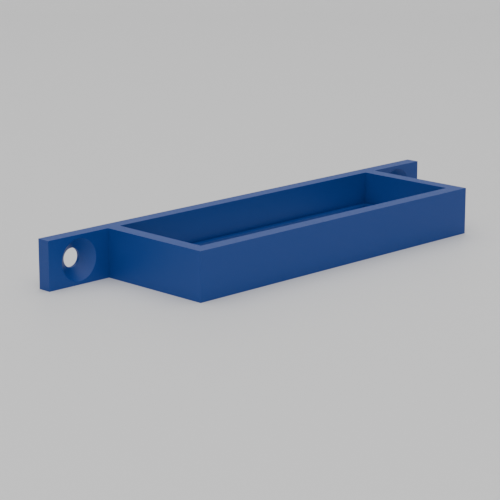
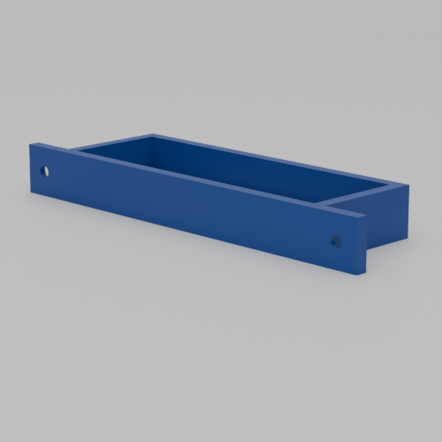
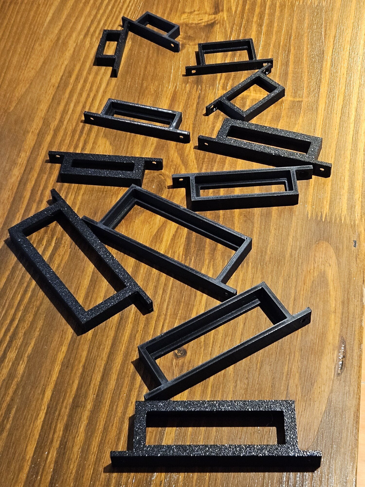
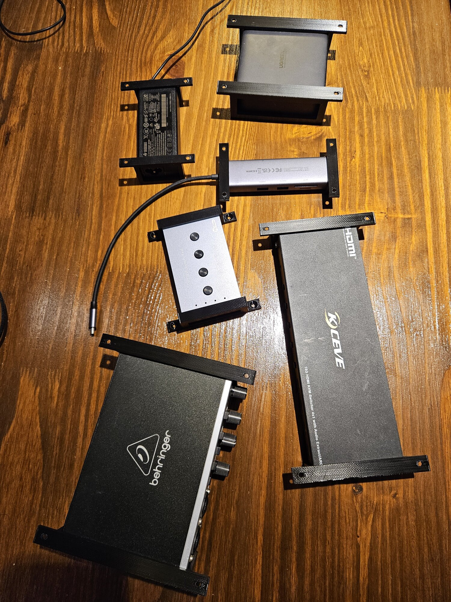
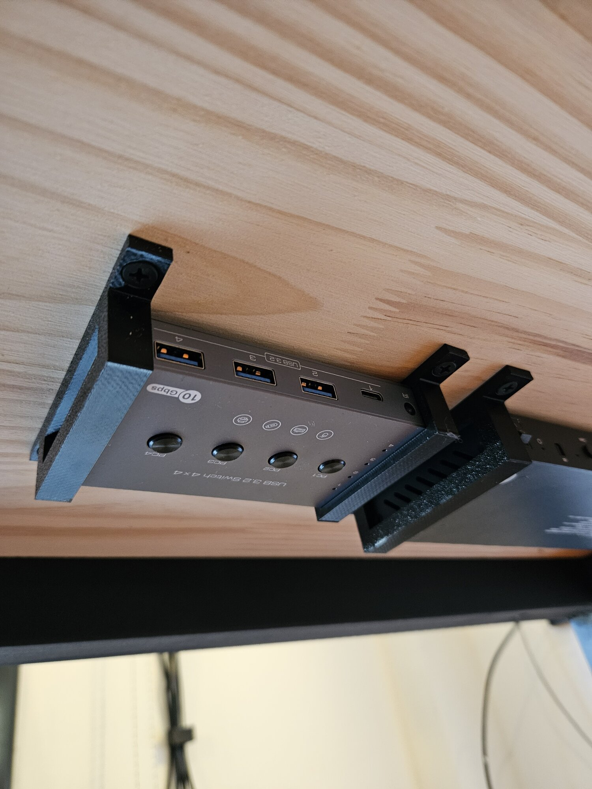
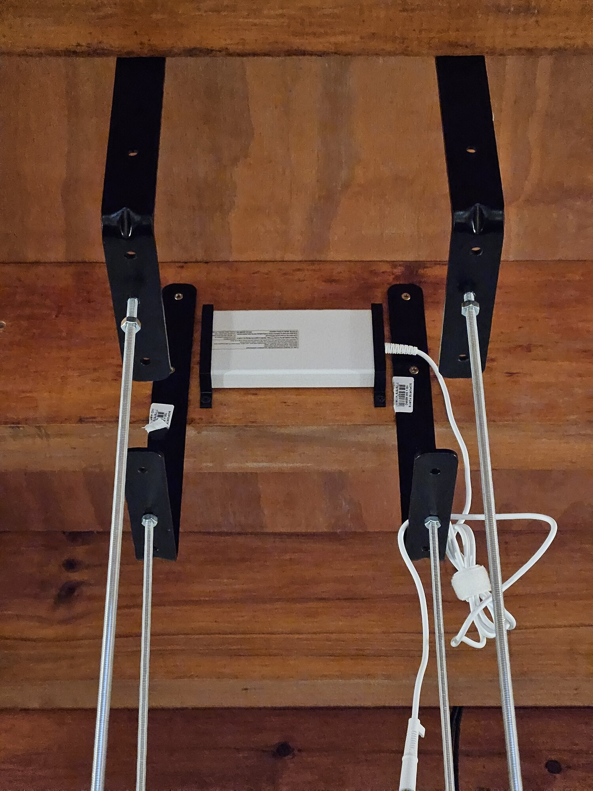

# Under-Desk Holder

A parametric OpenSCAD holder for mounting box-shaped devices underneath desks. Designed for power adapters, USB hubs, audio interfaces, KVM switches, and similar rectangular electronics.

## Design

The holder is a three-walled pocket with mounting tabs on each side. Box-shaped devices slide into the open front until they contact an internal stop ledge that prevents them from sliding through. The mounting tabs have countersunk screw holes for attaching to the underside of a desk.

This design only works with rectangular/box-shaped devices - it will not accommodate devices with irregular shapes, protruding buttons, or non-rectangular profiles.

## Example Presets

The OpenSCAD Customizer includes presets for several devices I use in my setup:

### Power Adapters

- **G27Q monitor AC adapter** - 46.8mm × 28.5mm
- **UGREEN Nexode 200W** - 101mm × 32.6mm
- **BenQ X300G Power Supply** - 72.6mm × 23.1mm

### Other devices

- **UGREEN 7-in-1 4K HDMI USB C Hub** - 35.6mm × 16.5mm
- **USB 3.2 Switch** - 62.8mm × 17.7mm
- **U-Phoria UMC202HD** - 107.3mm × 45mm (audio interface)
- **KCEVE KVM HDMI Switch 4 Ports** - 80.15mm × 23.15mm

Each preset defines the holder dimensions to fit the specific device with appropriate wall thickness, depth, and stop configuration.

## Usage

1. Open `main.scad` in OpenSCAD
2. Select a preset from the dropdown, or measure your device and customize the parameters manually
3. Adjust `holder_hole_width` and `holder_hole_height` to match your device dimensions (add ~0.5mm clearance)
4. Set `holder_depth` to determine how far the device slides in
5. Export to STL and print
6. Mount under your desk using wood screws through the side tabs

## Parameters Guide

### Holder Dimensions

- `holder_hole_width` - Interior width (device width + small clearance)
- `holder_hole_height` - Interior height (device height + small clearance)
- `holder_depth` - How far the device slides in before hitting the stop
- `wall_thickness` - Thickness of the holder walls (3-4mm recommended)

### Stop Configuration

- `stop_size` - Width/height of the internal stop ledge starting from the walls
- `stop_depth` - How thick the stop is (affects total holder depth)

### Mounting Tabs

- `tab_width` - Width of the mounting tabs (default 15mm)
- `tab_depth` - Depth of tabs (0 = same as total holder depth)
- `tab_height` - Height of tabs (0 = same as wall thickness)
- `hole_diameter` - Screw hole size in mm (3.5mm works with M3.5 or #6 wood screws)

## Tips

- Add 0.5-1mm clearance to your device measurements for easy insertion
- Use a larger `holder_depth` for heavier devices to provide more support
- The stop prevents devices from falling through - adjust `stop_size` based on your device's cable placement
- Print with the holder rotated 90° (opening facing up) for cleaner results and no supports needed
- Use wood screws that fit your screw hole diameter to mount to the desk

## Gallery

### Renders

  
  

### Photos

  
  

  
  

