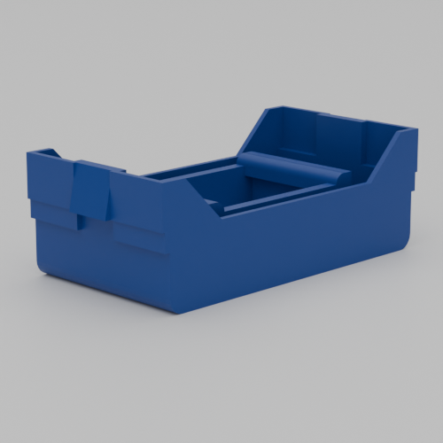
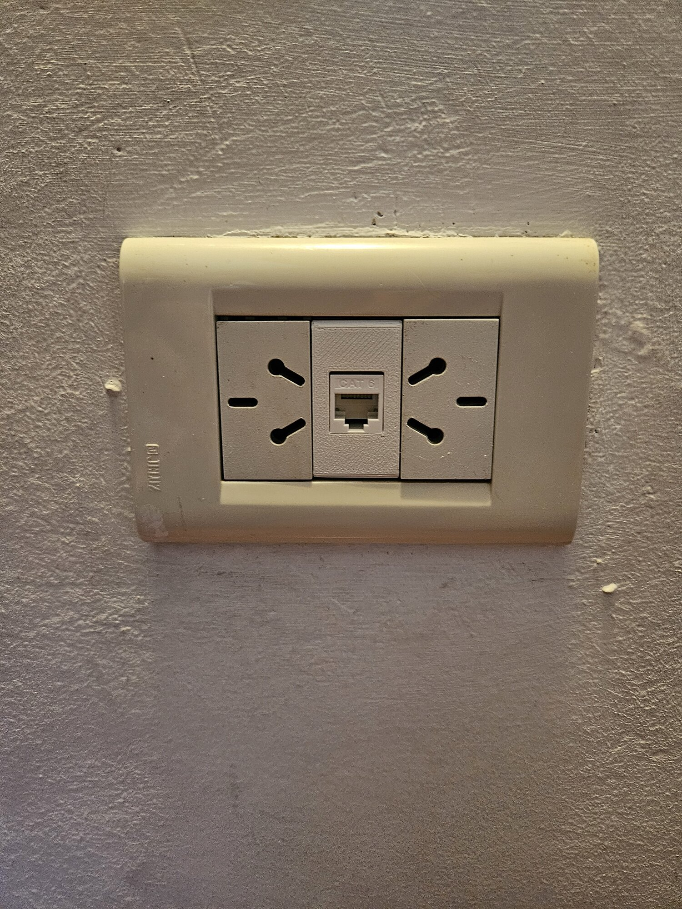
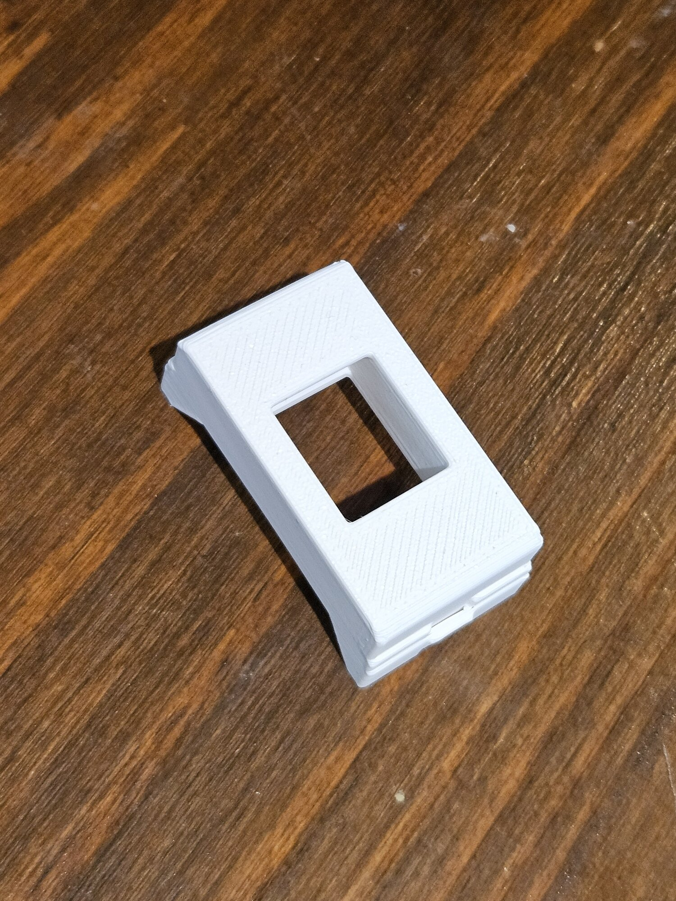
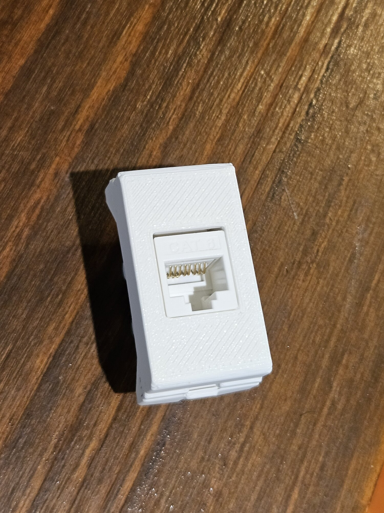
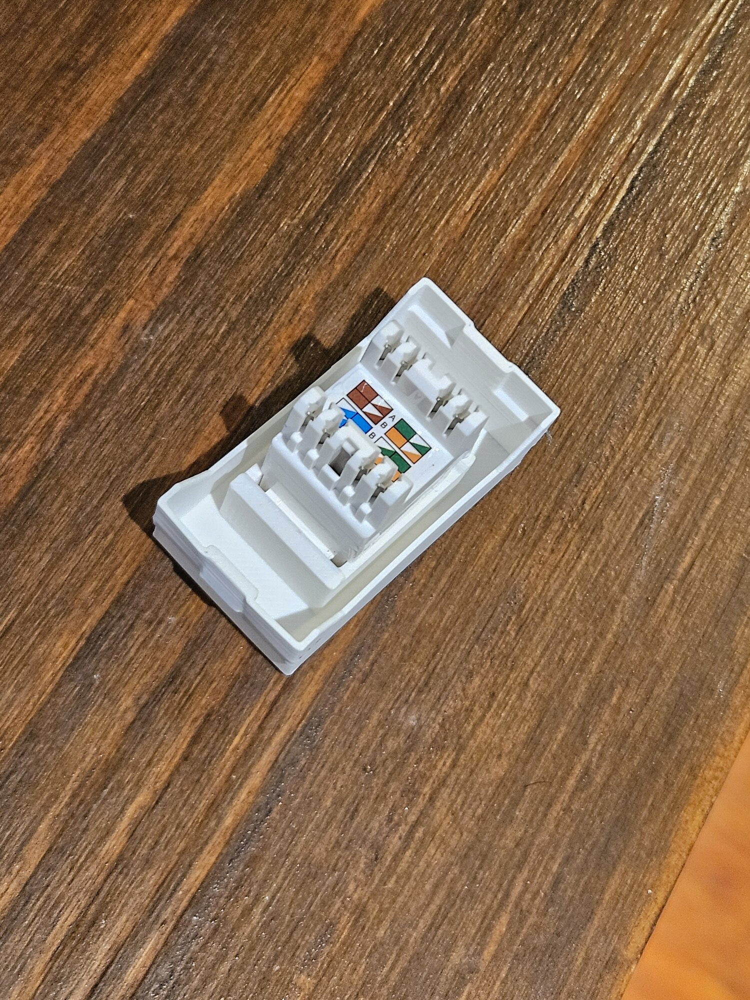

# Wall Outlet RJ45 Holder

A 3D printable case for RJ45 keystone jacks that fits Argentine wall outlet boxes (also compatible with Australian/New Zealand Type I outlets). The dimensions may not fit outlet boxes from other countries without modification.

## Usage

1. Open `main.scad` in OpenSCAD
2. Press F5 to preview or F6 to render
3. Export to STL (File → Export → Export as STL)
4. Print the holder
5. Insert the RJ45 keystone jack from the back - it should click into place
6. Mount to wall outlet box

## Gallery

### Renders

### Photos

  
  

  
  

## Credits

RJ45 Keystone Receiver module: [marcuswu/RJ45KeystoneReceiver](https://github.com/marcuswu/RJ45KeystoneReceiver)
